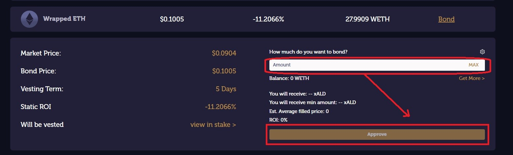

# Bonding

**Overview**\
Bonding is the process of trading another asset or a LP share to the protocol for $ALD. The protocol quotes an amount of $ALD and a vesting period for the trade. It is important to know: **when you create your bond, you are giving up your asset or LP share.** The protocol compensates you with more $ALD than you’d get on the market for this.\

.png>)

By clicking “Bond” icon here, you will be navigated to our Bond function main page.

.png>)

In the first column you have the binding asset (what you give up for $ALD); in the second column the bond price (the price you pay for 1 $ALD); in the third column you have the discount received from the market price (**DO NOT bond** if discount is negative); in the fourth column you can see the amount of assets bonded so far.

Continue by clicking “Bond” button for the asset which you want to bond. Lets take wETH as an example here.

Once you are here, you can see the bond details.

Input the wETH amount you want to bond and then click on the "Approve" button.

.png>)

Once you clicked the "Approve" button, you will be prompted by MetaMask to approve wETH spending. Click ''Confirm" (please make sure you have enough ETH to pay the transaction fees!)

.png>)

Once approved, the “Approve” button will be replaced with “Bond” - click on it

&#x20;.png>)

Once you clicked the "Bond" button, you will be prompted by MetaMask again to confirm you transaction. Click ''Confirm" (again, please make sure you have enough ETH to pay the transaction fees!)

After the transaction is confirmed on Ethereum mainnet - that's it! you've bonded and the vesting term has started.&#x20;
