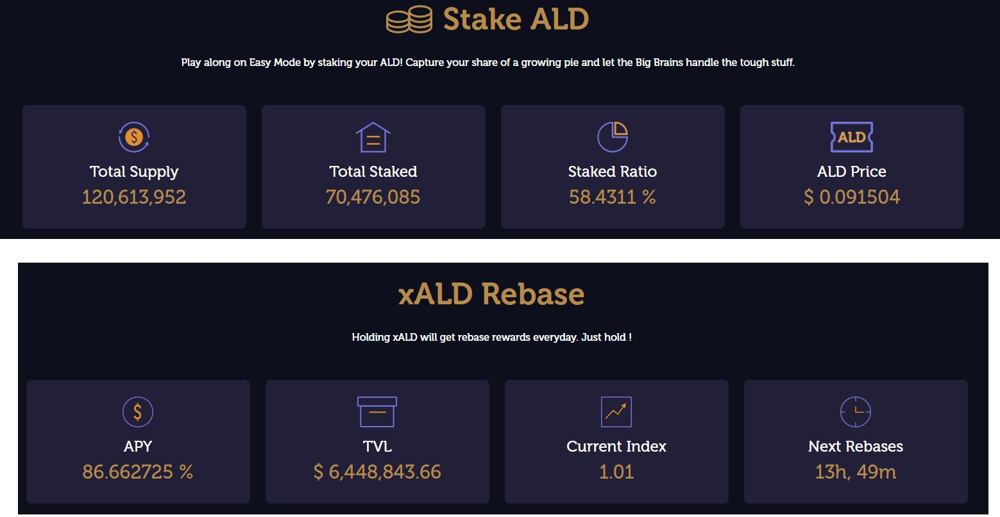

# Staking

On the Stake page you can deposit $ALD to earn yield on it.&#x20;

.png>)

By clicking “Stake” icon here, you will navigate to Stake page.

&#x20;

Core data about staked $ALD and $xALD rebase will be shown on the Stake main page. For details about Stake Protocol and the data definition, please refer to our staking section - h[ttps://docs.aladdin.club/staking](https://docs.aladdin.club/staking)

&#x20;

.png>)

To undergo the staking process, input the amount of ALD (or click MAX for the maximum amount) that you want to stake, then click the “Approve” button to approve $ALD spending.

&#x20;.png>)

Approve ALD spending in MetaMask

&#x20;

.png>)

Once approved, click on the “Stake ALD” button. As a reminder, your xALD will be vested for a period of 9 days. There's no cliff, so you will start earning rewards on the vested amount. Please note that you won't be able to withdraw the whole amount until after the vesting period!

&#x20;.png>)

Confirm the transaction in MetaMask.

&#x20;

.png>)

Once the transaction is completed, your ALD balance will be deducted and be shown in xALD Balance. That's all, you've staked your $ALD and started earning rewards!
