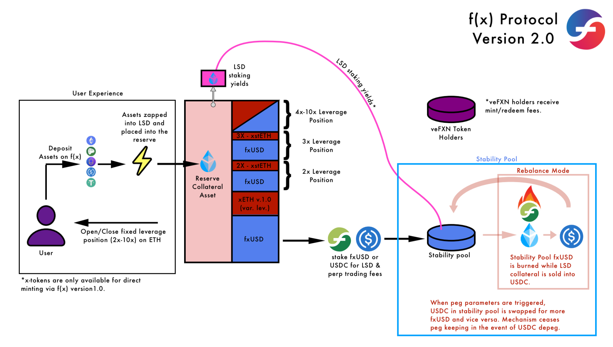

# Introduction of arUSD

In an era where DeFi is rapidly evolving, the concept of saving has transcended traditional bank accounts. Enter arUSD, an innovative autocompounding token designed to revolutionise how DAOs and individual users manage and grow their savings. Much like a high-yield savings account, arUSD offers users the opportunity to earn interest on their holdings. However, it goes a step further by automatically reinvesting earnings to maximise returns.

**arUSD** is the tokenized version of rUSD EtherFi Stability Pool vaults from Convex Finance. Why eETH? We believe EtherFi’s eETH is the most liquid and reliable LRT! Why Convex vaults? Boosted yield! Since Convex it’s a big veFXN holder, it provides the highest yield on f(x)’s Stability Pools.

**What Can You Do with arUSD?**

_Simple Savings_

You can simply hold arUSD in your wallet and treat it like a savings account, enjoying the benefits of automatic compounding interest.

_Advanced DeFi Strategies_

For more savvy DeFi users, arUSD offers a range of advanced options:

_Yield Splitting with Pendle:_

arUSD is ideal for use with Pendle, where it can be split into Principal Tokens (PT) and Yield Tokens (YT).

PT holders earn fixed yields to maturity plus LP incentives, while YT holders can earn all the yields along with restaking points.

_Collateral on Lending Protocols:_

arUSD is an ideal collateral for lending protocols.

As it already earns leveraged points, users can loop borrow against other stablecoins, leveraging up to earn more yields and points without liquidation risks under most circumstances.

_Layer 2 Utility:_

On Layer 2s, users can earn restaking yields and leveraged points with low transaction costs.

**What is the risk?**

\
As part of f(x)’s risk management mechanisms, liquidations may occur when rUSD goes into stability mode, redeeming rUSD in the stability pool for weETH at the prevailing liquidation price. The liquidated weETH is held in the vault, and converted back to rUSD only when the value of weETH in the vault is 105% of the redeemed rUSD.

Below is the Summary of arUSD:&#x20;

<figure><figcaption></figcaption></figure>
