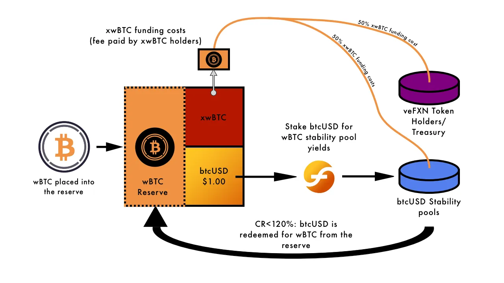

# Introduction of btcUSD/xwBTC

btcUSD offers the perfectly pegged, zero-beta USD stablecoin-with-awesome-yields experience that f(x) users love, while xwBTC brings the expected leverage long BTC excitement. With the added bonus that since btcUSD kicks in at a 120% collateral ratio, xwBTC’s effective leverage ratio can get up to 5.6x leverage!&#x20;

The key difference with wBTC is that, since it has no built-in yield, xwBTC holders pay a competitive funding rate for the leveraged price exposure. As with all other f tokens, holding btcUSD is free, and farming with it in the stability pool is lucrative.

The funding rate of xwBTC will simply track the borrowing rate of crvUSD against wBTC. Revenue is treated in the same way as any other reserve yield in f(x); it is divided evenly between the stability pool and the protocol (as revenue). wBTC flowing to the protocol is further subdivided, with 75% being paid to veFXN holders and 25% to the protocol treasury.

<figure><figcaption></figcaption></figure>
